# Ginger Personal Agent v2

**Last updated:** 2026-07-21

## Product and authority boundary

Ginger v2 is a local orchestration layer beside the original portrait tool and the
v1 manual-review bundle. It turns read-only WeChat evidence into bounded decisions
and encrypted drafts. Neither upstream portrait data, a model, a persona, a
relationship profile, nor an emotion proxy is an authorization system.

Persona and relationship state may change wording, tone, length, or delay. The
deterministic personal-style layer is narrower still: it reads only the active
current contact's `preferred_address`, `temperature`, `emoji_policy`, and
`preferred_emoji`, plus global `language_style.sentence_ending`. It cannot select a
recipient, add a fact or commitment, lower risk, increase confidence, change mode,
invoke a sender, or override a user-confirmed boundary. Emotion is a language-use
proxy, not a clinical measurement, and can only make the response calmer, shorter,
warmer, or later.

ChatGPT Pro has a separate, public-only independent-review role documented in
[CHATGPT_PRO_REVIEW.md](CHATGPT_PRO_REVIEW.md). It is not one of the production
model adapters, receives no local chat/state/secret data, and cannot approve,
schedule, arm, or send anything.

## Runtime flow

```mermaid
flowchart LR
  A["User LaunchAgent"] --> B["run-once + state lock"]
  B --> C["Read-only shard discovery"]
  C --> D["Three-state direction + HMAC identity"]
  D --> E["Encrypted ledger + transactional cursors"]
  E --> F["No-model reply-needed rules"]
  F -->|"filtered/manual"| G["Encrypted audit result"]
  F -->|"candidate"| H["Persistent budget reservation"]
  H --> I["OpenAI / GLM / loopback local"]
  I --> J["Strict ReplyDecision"]
  J --> K["Initial authority gate"]
  K --> L["Current-contact deterministic style"]
  L --> M["Post-render safety + safe-ack gate"]
  M --> N["Encrypted draft + durable delay"]
  N -. "due fully-gated autopilot" .-> O["One terminal send claim"]
  O --> P["Action-point Keychain canary"]
  P --> Q["Accessibility exact equality"]
  Q --> R["Exact outbound DB readback"]
```



`run-once` is short-lived. launchd schedules it, while the owned state lock keeps
the poll, budget, learning, and send-claim sequence single-writer. A pause marker or
kill switch returns before database, model, or sender initialization.

## Modes

The default in both code and example configuration is `shadow`.

| Mode | Database | Model | Draft | UI authority |
|---|---:|---:|---:|---|
| `observe` | Yes | No | No | None |
| `shadow` | Yes | Only after local rules | Encrypted | None |
| `approve` | Yes | Only after local rules | `approval_required` | One fresh approval can run one typing-only validation; no click |
| `autopilot` | Yes | Only after local rules | `autopilot_candidate` only after hard gates | Still needs explicit action-point canary and all send-time checks |

`approve-draft` creates a body/context/recipient-bound approval for 1-600 seconds and
returns `send_allowed=false`. `typing-validate` consumes the latest approval once,
revalidates the active UI identity, verifies recipient and entire body, and returns
`clicked=false` and `real_send=false`. Shadow drafts cannot enter this path.

## First-run, new-shard, and cursor semantics

The default bootstrap lookback is 24 hours. On the first run, rows in that window
are imported into the encrypted ledger; inbound rows are marked
`bootstrap_observed`. The model and sender are not constructed. A global bootstrap
record then persists the completion epoch with zero model and send actions.

Every later invocation rediscovers all direct `message/message_N.db` files and all
validated `Msg_<md5>` tables. Each known `(shard, table)` resumes from its own
`(create_time, local_id)` cursor minus the configured overlap. A table discovered
after bootstrap starts at the persisted global completion cutoff, so newly visible
shards cannot replay pre-install history. An existing runtime fails closed if this
global cutoff is absent, non-integer, or negative.

Each page is ordered by `(create_time, local_id)` and committed atomically with its
cursor. Event IDs use a keyed contact/local-id base plus a keyed canonical digest;
cross-shard/local-id conflicts receive a collision-safe identity. Re-reading an
overlap or restarting therefore inserts the same event at most once. A conflicting
event under an existing ID raises rather than overwriting evidence.

## Three-state direction

The reader classifies each row as `inbound`, `outbound`, or `unknown`:

- With a Keychain self ID, a resolved sender equal to self is outbound; another
  resolved sender is inbound; unresolved sender identity is unknown.
- Without a self ID, a direct-chat sender matching the contact can be inbound, but
  the runtime does not guess outbound. Group-chat and unresolved cases remain
  unknown.
- Real sending requires the self ID so post-click readback is direction-safe.

The current encrypted event schema persists only known inbound/outbound rows. If a
batch contains `unknown`, the reader emits a warning and commits only the known
rows. It never coerces `unknown` into an actionable direction, and unknown rows
cannot trigger a reply or confirm an outbound send.

## ReplyDecision and deterministic gate

The only accepted model object has exactly these fields:

```json
{
  "intent": "acknowledge",
  "stance": "Example acknowledgement.",
  "facts": [],
  "commitments": [],
  "risk": "low",
  "confidence": 0.95,
  "reply_required": true,
  "context_sufficient": true,
  "reasons": ["example_reason"]
}
```

Unknown or duplicate keys, tool/function calls, non-finite numbers, extra choices,
oversized requests/responses, malformed envelopes, redirects, and schema failures
are rejected. Message and context text are untrusted data and cannot request tools
or elevate authority.

The context is contact-only and bounded by `model.context_messages` (12 by default),
with each body bounded before transport. The “complete context” gate means the
validated decision must set `context_sufficient=true`; it does not claim lifetime
chat history is loaded. Any proposed fact must also occur verbatim in the current
bounded context or active distillation payload. Model self-report alone is never
sufficient.

| Gate condition | Result |
|---|---|
| Money, contract, medical, legal, verification-code, credential, privacy, conflict, or major relationship risk | Permanent human handling |
| Any declared or rendered commitment | Human handling |
| Incomplete context or any ungrounded fact | Human handling |
| `reply_required=false` or confidence below `0.70` | No reply |
| `0.70 <= confidence < 0.92` | Draft only |
| Missing allowlist, budget, or frequency capacity | Draft only |
| Fully eligible in `approve` | Fresh human approval required; typing-only |
| Fully eligible in `autopilot` | Candidate only, not send permission |

### Deterministic personal-style render

After exact `ReplyDecision` parsing and the initial authority gate, the runtime
renders the semantic stance and applies one bounded, deterministic style pass. Its
inputs are restricted by scope:

- active `relationship` for the current contact only:
  `preferred_address`, `temperature`, `emoji_policy`, and `preferred_emoji`;
- active global `language_style`: `sentence_ending` only.

No other contact's relationship payload is available to this pass. Address and
emoji decoration are conditional on the bounded tone/policy controls, and malformed
or oversized style tokens are ignored. The layer transforms only the candidate
body; it cannot change the structured facts, commitments, risk, confidence,
recipient, allowlist status, mode, budget, or sender state.

The post-render gate then scans the final body again for sensitive risk and
commitment language. Autopilot is narrower than the initial table: the final body
must also remain fact-free and reduce to one of the canned low-risk acknowledgements
after terminal punctuation is removed. A style change can turn an otherwise eligible
autopilot candidate into `draft_only` or `manual_required`; no style input can turn a
weaker result into an autopilot candidate. The final styled body and downgraded gate
result are what the encrypted draft persists.

## Model adapters and persistent budget

`openai`, `glm`, and `local` share a fail-closed OpenAI-compatible chat-completions
transport. OpenAI requests use strict JSON Schema; GLM and local requests require a
single JSON object that is then checked by the same exact parser. Remote providers
require HTTPS. `local` permits HTTP or HTTPS only when the hostname is literal
loopback (`localhost`, IPv4 loopback, or IPv6 loopback); lookalike DNS names and LAN
addresses are rejected.

Remote API credentials are fetched from macOS Keychain at model construction. TOML
accepts only account references and rejects raw secret-shaped fields or values.
Requests have time, request-byte, response-byte, and output-token caps. Authorization
headers are not forwarded across redirects because redirects are rejected.

Before transport, the persistent budget journal reserves one call, request UTF-8
bytes as a conservative input-token upper bound, configured maximum output tokens,
and the corresponding maximum cost. Valid provider usage is committed afterward.
Timeout, malformed response, or other failed transport consumes the reservation at
its maximum because the client cannot prove it was unbilled. Daily call/USD totals
are encrypted and survive launchd restarts. Paid models require explicit pricing;
local models default to zero USD while still consuming the call count. Database
polling and local rule screening consume zero model calls.

## Six-domain versioned distillation

Every immutable version records a unique ID, parent, evidence IDs, confidence,
canonical payload SHA-256, protected fields, correction type, domain, contact scope,
and timezone-aware creation time.

| Domain | Scope | Safe automatic behavior |
|---|---|---|
| `stable_facts` | Global | No changed fact may activate without user confirmation |
| `values_boundaries` | Global | Fully protected; explicit confirmation required |
| `relationship` | Exactly one contact | Non-boundary style/latency observations only |
| `decision_preferences` | Global | Local correction aggregate |
| `language_style` | Global | Local correction aggregate |
| `emotion_cycle` | Global | Outbound-text-only language proxy |

`relationship` requires a non-empty pseudonymous contact namespace. Parents,
activation, and rollback cannot cross domain or contact scope. Rollback can activate
only an ancestor of the current active version; unrelated branches are rejected.
Payloads and active pointers are encrypted in the ledger and survive restarts.

Stable facts and values receive wildcard protection. Relationship boundaries,
`display_name`, and `ui_search_token` are mandatory protected fields. Automatic
learning cannot change any of them. Setting
`learning.auto_activate_safe=false` keeps even safe automatic versions inactive
until `distill-activate` is run.

## User-confirmed UI identity enrollment

Sending and typing require two different values for each contact:

- `display_name`: the exact visible label expected once in search results and once
  in the opened conversation;
- `ui_search_token`: a different, private value pasted into WeChat search.

The active relationship version must protect both fields, and that version or one
of its ancestors must be `user_confirmed` with the identical pair. Drafts store the
active version ID; action-time validation rejects a stale or changed binding.

Create a private, untracked `ui-identity.enrollment.json`:

```json
{
  "display_name": "Example Contact A",
  "ui_search_token": "example-unique-search-token-a"
}
```

Then bind the pair to the local pseudonym:

```bash
AGENT_HOME="${GINGER_AGENT_HOME:-$HOME/Library/Application Support/GingerAgent}"
AGENT="$AGENT_HOME/bin/ginger-agent"
CONFIG="$AGENT_HOME/config.toml"
CONTACT_KEY="${CONTACT_KEY:?set a locally generated contact_ pseudonym}"

chmod 600 ui-identity.enrollment.json
"$AGENT" --config "$CONFIG" distill-put \
  --domain relationship \
  --contact-key "$CONTACT_KEY" \
  --payload-file ui-identity.enrollment.json \
  --confidence 1 \
  --protected-field display_name \
  --protected-field ui_search_token \
  --user-confirmed \
  --activate
```

The example values are fictional. Replace them only on the local machine, keep the
file out of Git, and never publish the resulting contact mapping.

## Relationship/emotion delay and one-attempt rule

At draft time, emotion tension/activation can impose a 900-second delay, while the
active relationship payload can provide `reply_delay_seconds` up to 86,400 seconds.
The larger delay wins. The encrypted draft stores both `delay_seconds` and an
absolute `not_before_epoch` based on the source event time.

Before that time, no send attempt is made. Once due, the runtime reconstructs the
stored decision and rechecks its schema, original message risk, commitments, the
persisted post-style body, current mode, allowlist, daily budget, and per-contact
frequency without a second model call. It does not rerun the model, restyle the
body, or recompute emotion; it preserves the already selected wording and delay.
Immediately before UI mutation it polls again and requires the source event to
remain the latest event for that contact and to remain inbound.

At due time, active identity validation, the latest-event poll, deterministic request
construction, and a non-consuming Keychain canary preflight all occur before a send
claim. A missing, invalid, or expired canary means zero send attempts and no claim,
so the draft remains available for explicit action-point arming. Once preflight
passes, the runtime writes one durable `draft-send` claim. Invalid, stale, blocked,
duplicate, uncertain, failed, or readback-unconfirmed outcomes after that point are
terminal with `retry_allowed=false`; later launchd cycles and restarts cannot attempt
that draft again.

## Real-send contract and action-point canary

Configuration validation requires all of these before real-send mode can load:

- mode is `autopilot`;
- `real_send_enabled=true` and `typing_only=false`;
- the hashed allowlist is non-empty;
- Accessibility is the primary sender.

Candidate creation additionally requires low risk, no commitments, confidence at
least `0.92`, sufficient bounded context, verbatim-grounded facts, allowlist, budget,
frequency capacity, and the narrower canned/fact-free body rule. A due candidate is
still not authorized to click.

`arm-send-canary` is the only supported action-point arming operation:

```bash
DRAFT_ID="${DRAFT_ID:?select a due autopilot_candidate draft}"
"$AGENT" --config "$CONFIG" arm-send-canary \
  --draft-id "$DRAFT_ID" \
  --expires-seconds 120 \
  --confirm SEND_ONCE
```

It rejects anything except the exact confirmation `SEND_ONCE`, expiry from 1 through
600 seconds, enabled autopilot mode, an allowlisted contact, a due authenticated
`autopilot_candidate`, a still-valid user-confirmed UI identity, and a draft with no
terminal send claim. It derives the attempt ID deterministically from draft ID,
event ID, contact key, and full body; writes a Keychain canary bound to that attempt,
contact, body SHA-256, and expiry; and records `send_executed=false` in the encrypted
audit state. The command itself does not click.

The installer and launchd job never arm a canary. A human must run the command at
the action point. This prerelease has not run `arm-send-canary`; no real send is
claimed by this documentation or this documentation task.

At execution, Accessibility consumes and deletes the canary before pressing Return.
The script requires one exact `display_name` match, an empty composer, and complete
editor equality with the draft. This is `editor == body`, not `endswith(body)` and
not a trimmed comparison. Timeout or uncertainty after UI mutation is terminal.

Computer Use is an optional, separately installed, owned, executable,
non-group/world-writable helper with a strict JSON stdin/output contract. It may be
used only for typing-only drift recovery. It rejects `click_send` unconditionally,
and a click-capable Accessibility request is never replayed through a fallback.

Before a click, the reader records all existing outbound IDs and a high watermark.
Afterward, success requires a new outbound event for the same contact, strictly
after that baseline, whose complete UTF-8 body equals the draft. Old identical
messages and suffix matches do not count. Failure moves the attempt to terminal
`failed`; only `readback_confirmed` is treated as confirmed.

## State, Keychain, and encrypted ledger

Application directories are mode `0700`; configuration, ledger, and control files
are mode `0600`. Symlink, foreign-owner, and group/world-writable checks protect
config, executables, helpers, database paths, and service files.

The Keychain service holds separate accounts for the 32-byte AES state key, identity
HMAC key, optional self ID, SQLCipher keys by database salt, optional provider key,
and an explicitly armed one-time canary. Secret values are supplied over stdin where
supported and are not accepted in configuration.

Message text, display labels, drafts, corrections, distillation versions, budget
records, send payloads, and audit payloads are stored in versioned AES-256-GCM
envelopes with contextual authenticated data. Contact and body lookup fields use
derived HMACs. Runtime records are immutable; active pointers are separate. The
audit chain is HMAC-linked and fails verification after tampering.

## launchd and readiness operations

```bash
"$AGENT" --config "$CONFIG" doctor
"$AGENT" --config "$CONFIG" run-once
"$AGENT" --config "$CONFIG" install-service
"$AGENT" --config "$CONFIG" status
"$AGENT" --config "$CONFIG" cost-report
"$AGENT" --config "$CONFIG" pause
"$AGENT" --config "$CONFIG" resume
"$AGENT" --config "$CONFIG" kill-switch --enable
"$AGENT" --config "$CONFIG" kill-switch --clear
"$AGENT" --config "$CONFIG" uninstall-service
```

`install-service` writes an owned `0600` user LaunchAgent, then uses `bootout`,
`bootstrap`, and `kickstart`. `uninstall-service` requires successful `bootout`,
confirms the job is gone, and removes the plist. `resume` refuses while the kill
switch remains active.

`doctor` is non-mutating and performs zero network, model, or send actions. The CLI
returns `0` only when all required checks pass, `1` when the report is not ready, and
`2` for load/config/command errors. The prerelease readiness profile intentionally
requires real send to remain disabled; Accessibility is required only for
`approve`/`autopilot` readiness.

## Fixed-tag installation and upgrade

Production-style installation and upgrades use an immutable GitHub Release tag, the
tag-specific source archive, and its published `SHA256SUMS`. The downloader rejects
invalid repository/tag syntax, checksum mismatch, paths outside the single archive
root, traversal, links, and special files. `install-macos.sh` then installs locked
dependencies into a new versioned virtual environment and atomically switches the
stable command links.

No published Release is asserted here. Once a chosen fixed tag is visibly published,
use `scripts/install-release.sh "$RELEASE_TAG"` for initial installation or the
installed `install-release` command for upgrade/rollback. Re-run `doctor` and
`install-service` afterward so launchd points at the selected interpreter. Never use
scheduled or manual `git pull` as the installed upgrade path.

## Corrections and local refresh

`record-correction` stores the model draft, user edit, final reply, and structured
length/wording/emoji differences in encrypted form. It creates global style and
decision candidates plus a current-contact-only relationship-style candidate. The
periodic refresh materializes immutable versions only after the configured interval
and sample threshold, with no model or UI call.

Relationship refresh computes explainable address, length, warmth, initiative,
emoji, and reply-latency observations. It preserves the nearest user-confirmed
boundaries and UI identity exactly; any mismatch skips the update. Emotion refresh
uses outbound text only and stores compact non-clinical proxies. Stable facts,
values, privacy boundaries, and relationship boundaries never change automatically.

## v1 compatibility and acceptance boundary

Legacy `build`, `draft`, `review`, and `status --state` commands remain available.
They produce a manual-review bundle and never authorize the v2 sender.

Synthetic tests cover encryption, cursor restart, new-shard cutoff, three-state
direction, duplicate import, collision handling, budget persistence, six-domain
isolation, rollback, protected knowledge, UI identity binding, approval consumption,
deterministic canary arming/consumption, full-body equality, readback baseline, and
terminal no-retry behavior. Fixtures contain fictional data.

The prerelease acceptance boundary is Shadow plus controlled typing-only validation.
The existence of gated Accessibility and canary code is not evidence that a real
send or a GitHub Release has occurred.
