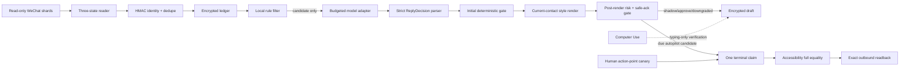

# Security and privacy model

**Last updated:** 2026-07-21

## Non-negotiable invariants

1. The default mode is `shadow`; first-run history creates no model call, draft, UI
   action, or send action.
2. Database polling has no model or network dependency and opens WeChat data
   read-only.
3. Direction is `inbound`, `outbound`, or `unknown`. Unknown is never guessed into
   an actionable state.
4. Raw account identifiers and database keys are transient. Persistent contact
   identity is a Keychain-keyed `contact_...` pseudonym.
5. Sensitive event, draft, correction, distillation, budget, send, and audit payloads
   are AES-256-GCM encrypted before SQLite persistence.
6. The deterministic personal-style layer reads only the current contact's
   `preferred_address`, `temperature`, `emoji_policy`, and `preferred_emoji`, plus
   global `language_style.sentence_ending`. It may downgrade a result or delay
   execution but can never increase authority.
7. Stable facts, values, relationship boundaries, `display_name`, and
   `ui_search_token` cannot change automatically.
8. Every autopilot fact must occur verbatim in current contact-only evidence;
   model-reported context sufficiency alone cannot authorize it.
9. Permanent-manual risk, any commitment, incomplete context, or post-render risk
   blocks autopilot regardless of confidence.
10. A delayed draft is revalidated when due. Missing canary means zero attempts;
    after canary preflight passes it receives at most one terminal send claim.
    Failure or uncertainty is never retried automatically.
11. UI identity requires a user-confirmed, active per-contact binding between an
    exact `display_name` and a different `ui_search_token`.
12. Computer Use can verify typing only. It rejects every `click_send` request.
13. Only Accessibility can consume a one-time canary and click, and its editor value
    must equal the complete body. Suffix or trimmed equality is insufficient.
14. A click is not confirmed until a strictly post-click outbound database event for
    the same contact equals the complete body.
15. Installation and launchd never arm a canary. Arming requires the explicit
    action-point confirmation `SEND_ONCE` and has not been run for this prerelease.

## Trust and authority map



No text model, profile, browser session, ChatGPT conversation, Computer Use helper,
or incoming message can alter mode, allowlist, protected knowledge, budget, UI
identity, canary, or send-state transitions.

## Reader, bootstrap, and deduplication controls

- The SQLite fixture/decrypted backend uses URI `mode=ro`, `query_only`, one
  statement, bounded execution, and read-only SQL verbs.
- The SQLCipher backend requires a trusted absolute executable, read-only/batch
  mode, numeric bound parameters, per-file keys from Keychain, and bounded output.
- Every poll rediscovers direct numeric message shards and validated message tables.
  Symlinks, escaped paths, ambiguous table identity, missing columns, malformed rows,
  non-monotonic rows, oversized content, and decode failures fail closed or emit a
  bounded warning marker.
- First run applies the configured lookback and records no model/send action. Its
  persisted completion epoch becomes the global cutoff for every table discovered
  later. Existing tables retain independent cursors and a bounded overlap.
- HMAC-derived event IDs, canonical event HMACs, collision IDs, primary-key insertion,
  and atomic cursor advancement make overlap/restart ingestion idempotent. Conflicting
  content under one identity raises instead of replacing stored evidence.
- `unknown` direction rows are warned and excluded from the current two-state event
  ledger. They cannot reach reply logic or outbound readback.

## Keychain and encrypted state

Configuration stores Keychain account names only. It rejects raw fields or values
that resemble API keys, passwords, bearer tokens, or secrets. The Keychain service
holds separate accounts for:

- the 32-byte ledger encryption key;
- the contact/event identity HMAC key;
- the optional local self ID needed for direction-safe real sending;
- SQLCipher keys keyed by database salt;
- an optional selected-provider API key;
- an explicitly armed, attempt-bound one-time canary.

Keychain values are not put into config or logs. The generic secret storage command
is not an approval or canary-issuance workflow.

The ledger encrypts payloads using versioned AES-256-GCM envelopes and contextual
authenticated data. Contact/body indexes use derived HMACs rather than plaintext.
Events, runtime records, and distillation versions are immutable; active version
pointers are separate. A linked HMAC audit chain detects deletion, reordering, or
mutation when verified. Files and directories use private modes, and symlink,
ownership, and writable-permission checks protect sensitive entry points.

## Model and budget isolation

The runtime has exactly three configured adapter classes:

- OpenAI over HTTPS with strict JSON Schema output;
- GLM over HTTPS with an OpenAI-compatible JSON response;
- local OpenAI-compatible inference over HTTP or HTTPS only on literal loopback.

All produce the same exact `ReplyDecision` object. Tool/function calls, redirects,
duplicate JSON keys, additional fields, extra choices, invalid UTF-8, malformed JSON,
oversized bodies, non-success status, and timeout fail closed. Input chat and context
are explicitly untrusted and cannot invoke a tool.

After parsing and the initial gate, a deterministic renderer may use only the active
current-contact style fields `preferred_address`, `temperature`, `emoji_policy`, and
`preferred_emoji`, plus global `language_style.sentence_ending`. It has no write path
to the decision or authorization state. The completed body is then rescanned for
sensitive risk and commitment language, and an autopilot candidate must still pass
the fact-free canned safe-ack check. This pass can return `draft_only` or
`manual_required`; it cannot create or strengthen an autopilot candidate.

The encrypted budget journal reserves one call and conservative maximum cost before
transport. Daily call and USD limits survive restarts and are evaluated in the
configured timezone. Paid providers require explicit model pricing; unknown pricing
blocks the call. Local inference defaults to zero USD but consumes the call count.
Failed calls conservatively consume their reservation. Polling and local rule checks
are zero-call operations. Confirmed sends also face a separate per-contact hourly
frequency cap.

ChatGPT Pro is only a public-material independent reviewer. It is not a configured
runtime adapter, receives no local messages/state/secrets, and has no approval,
canary, UI, or send authority.

## Human approval is not send approval

In `approve` mode, an eligible draft receives status `approval_required`.
`approve-draft` creates a body-hash/context/recipient-bound record valid for at most
600 seconds and explicitly returns `send_allowed=false`. `typing-validate` consumes
that approval once, checks the active user-confirmed UI identity and full body, and
must return `clicked=false`. The approval cannot be used by the autopilot click path.

Permanent-manual categories remain human-only in every mode: money, contracts,
medical/legal matters, verification codes, credentials, privacy disclosure,
conflict, and major relationship decisions.

## UI identity binding

Each sendable contact needs one active `relationship` version containing:

- non-empty `display_name` for exact visible-label verification;
- non-empty `ui_search_token` for search;
- different trimmed values;
- mandatory protection of both paths;
- a `user_confirmed` version or ancestor carrying the same pair.

The draft records the active version ID. Approval, arming, and sender preparation
reject an absent, changed, stale, cross-contact, automatically invented, or
same-value pair. Automatic relationship learning preserves these fields byte for
byte or skips the update.

## Delay persistence and send-time revalidation

Emotion tension/activation and relationship latency may increase a response delay.
The draft persists the selected delay and absolute `not_before_epoch`; neither
launchd restart nor a second model call is needed. Before the due time, arming and
sending are rejected.

At due time the runtime reparses the durable decision and rechecks original-message
risk, commitments, the persisted post-style body's safety, mode, allowlist, current
budget, frequency, and draft integrity. It does not call the model or restyle the
body. It then revalidates the active UI identity, polls the database, requires the
source event still to be the latest inbound event for that contact, and performs a
non-consuming check for the exact canary. An absent, invalid, or expired canary
produces zero send attempts and no claim. Only after preflight passes does the
runtime claim the draft once. Any subsequent block or failure leaves a terminal
marker with `retry_allowed=false`.

## Action-point canary

The supported command shape is:

```bash
ginger-agent --config "$CONFIG" arm-send-canary \
  --draft-id "$DRAFT_ID" \
  --expires-seconds 120 \
  --confirm SEND_ONCE
```

The command fails unless all of the following are true:

- confirmation is exactly `SEND_ONCE`;
- expiry is an integer from 1 through 600 seconds;
- mode is `autopilot` and `real_send_enabled=true`;
- the draft contact is in the active hashed allowlist;
- the encrypted draft is an authenticated, due `autopilot_candidate`;
- its active UI identity still has the required user-confirmed binding;
- no terminal `draft-send` claim exists;
- body and event identity are valid.

It derives a deterministic attempt ID from draft ID, source event ID, contact key,
and full body. The Keychain record is bound to that attempt ID, contact, full-body
SHA-256, and expiry. An encrypted action record is appended with
`send_executed=false`. If that append fails, the Keychain record is deleted. The
arming command itself does not click or send.

Neither `install-macos.sh` nor launchd invokes this command. A person must run it at
the action point. This prerelease has not run it, and the existence of this code is
not evidence of real-send execution.

## Accessibility, Computer Use, and readback

Only Accessibility is permitted as the primary backend when real sending is enabled.
Before Return it must:

1. consume and delete the matching unexpired canary before any UI mutation;
2. search using `ui_search_token`;
3. find exactly one visible `display_name` match;
4. open the conversation and again find exactly one matching label;
5. require an empty focused composer;
6. paste through the clipboard;
7. require the complete editor string to equal the complete draft body;
8. return an explicit final marker after pressing Return.

Body equality is not a suffix check and does not trim whitespace. UI timeout,
recipient mismatch, non-empty composer, body mismatch, missing final marker, or
post-mutation uncertainty is terminal. Because the canary is already consumed,
even a pre-click verification failure leaves that draft terminal; the runtime cannot
re-arm or replay it automatically.

Computer Use receives a bounded JSON request and must return the matching attempt,
contact, body SHA-256, recipient verification, body verification, and clicked state.
It rejects `click_send` before invoking the helper. It may be a fallback only for a
typing-only `UIDriftDetected`; click-capable requests are never replayed.

Immediately before Accessibility, the reader captures existing outbound event IDs
and the highest `(create_time, local_id, event_id)`. Confirmation requires a new
outbound identity strictly above that baseline for the same contact and an exact
complete UTF-8 body. Old identical messages, suffixes, whitespace variants, wrong
direction, and wrong contact fail. `sent` is only provisional;
`readback_confirmed` is the sole confirmed terminal success state.

## Readiness, emergency controls, and service lifecycle

`doctor` reads configuration and local readiness only; it reports zero network,
model, and send actions. The CLI exits `0` only when required checks pass, `1` for a
not-ready report, and `2` for configuration or command errors. The prerelease doctor
profile treats `real_send_enabled=true` as not ready.

`pause` writes a durable pause marker. The kill switch writes both emergency and
pause markers. `resume` refuses until the kill switch is explicitly cleared.
`install-service` validates the installed executable, writes an owned `0600` user
LaunchAgent, and runs launchctl `bootout`, `bootstrap`, and `kickstart`.
`uninstall-service` requires successful `bootout`, verifies absence, and removes the
plist.

## Release and publication boundary

Installed versions must come from one explicit GitHub Release tag and the matching
published `SHA256SUMS`. The installer validates tag/repository syntax, HTTPS
download, archive checksum, one safe root, traversal, and the absence of links or
special files before installation. Upgrade and rollback select another explicit
fixed tag; `git pull` is not an installed update mechanism.

No GitHub Release is asserted to exist by this document. Release publication itself
requires a clean tracked tree, tests, tracked-tree scan, archive scan, tag/package
version match, and tag verification.

Only source, tests, fictional fixtures, documentation, installers, lock files, and
LaunchAgent templates may enter the candidate tree. The release scanner examines
tracked and untracked candidate files and rejects non-allowlisted paths, SQLite
databases, local user paths, non-synthetic identifiers, credentials, private keys,
unexpected binaries, symlinks, and oversized files. Exports, message databases,
WAL/SHM files, state, logs, model responses, key files, UI identity payloads, and
contact mappings must remain untracked.

## Residual risks

- WeChat's private schema and Accessibility tree can change without notice. Defensive
  discovery and fail-closed UI matching reduce but do not eliminate compatibility
  risk.
- Full Disk Access and Accessibility are broad permissions. Grant them only to the
  checksum-verified installed environment and review them after upgrades.
- A process running as the same local user may be able to request Keychain access,
  depending on Keychain policy. Device login security and disk encryption remain
  important.
- Language-derived emotion and relationship latency are uncertain behavioral
  proxies. They must never be interpreted as diagnosis, consent, or authority.
- A canary authorizes one deterministic attempt but cannot prove WeChat displayed or
  delivered the message; exact database readback is required and still cannot prove
  remote receipt.
